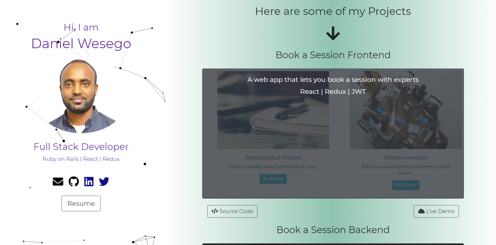

# Portfolio
> This is my personal website or portfolio. It is made using ReactJS.


## Built With

- React
- Bootstrap
- EmailJS
- ParticleJS
- JavaScript
- Node


## Live Link

🔥 [Live Link](https://danielmitiku.github.io/portfolio/)

## Screenshot



## Get Started

- If you want to use my Portfolio as a sample, you can do this:

*Clone the repo to your local machine*
```bash
    git clone https://github.com/DanielMitiku/portfolio.git
    cd portfolio
```

*Install the necessary packages and start development server*

```bash
    npm install
    npm start
```

*Open development server in your browser*

Open http://localhost:3000 in your browser.

## Author

- Github: [Daniel Mitiku](https://github.com/DanielMitiku)
- LinkedIn: [@daniel-wesego](https://www.linkedin.com/in/daniel-wesego/)
- Email: wedanielmitiku@gmail.com


## 🤝 Contributing

- Contributions, issues and feature requests are welcome!

- Feel free to create PR.

## Show your support

- Give a ⭐️ if you like this project and follow me on [Github](https://github.com/DanielMitiku) for more projects like this.

## 📝 License

- This project is [MIT](lic.url) licensed.
